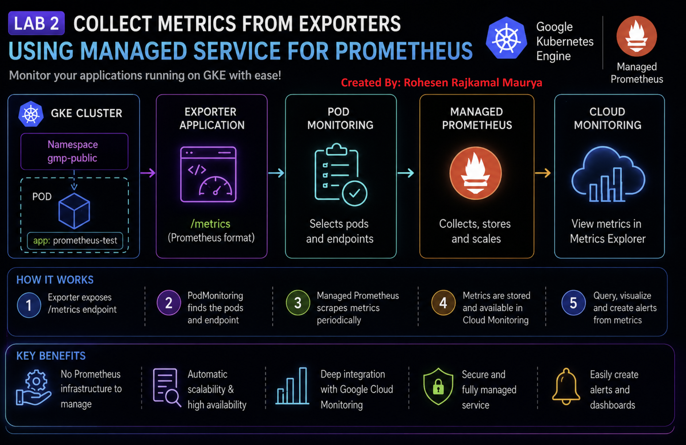

# 📊 Collect Metrics from Exporters using Managed Service for Prometheus

## 🧪 Lab Overview

This lab demonstrates how to collect application metrics using **Google Cloud Managed Service for Prometheus**.

The lab focuses on deploying a Prometheus exporter application on Google Kubernetes Engine (GKE), configuring Pod Monitoring, and verifying that metrics are collected successfully.


---

## 🎯 Objectives

In this lab, I learned how to:

- Enable Managed Service for Prometheus on a GKE cluster
- Deploy a Prometheus exporter application
- Create a Kubernetes namespace
- Configure Pod Monitoring
- Configure Prometheus metrics endpoints
- Verify that metrics are being collected
- Query collected metrics using Google Cloud Monitoring

---

## 🏗️ Architecture

```text
                    Google Cloud
                         │
                         ▼
                ┌─────────────────┐
                │       GKE       │
                │    Kubernetes   │
                └────────┬────────┘
                         │
                         ▼
              ┌─────────────────────┐
              │ Prometheus Exporter │
              │      Application    │
              └──────────┬──────────┘
                         │
                    /metrics
                         │
                         ▼
              ┌─────────────────────┐
              │   Pod Monitoring    │
              └──────────┬──────────┘
                         │
                         ▼
              ┌─────────────────────┐
              │ Managed Prometheus  │
              │     Collection      │
              └──────────┬──────────┘
                         │
                         ▼
              ┌─────────────────────┐
              │ Cloud Monitoring    │
              │   Metrics Explorer  │
              └─────────────────────┘
````


# 🔧 Step 1: Configure the GKE Cluster

First, I configured the GKE environment and connected `kubectl` to the Kubernetes cluster.

```bash
gcloud container clusters get-credentials CLUSTER_NAME \
    --zone ZONE \
    --project PROJECT_ID
```

Verify the connection:

```bash
kubectl get nodes
```

### Expected Output

```text
NAME                                           STATUS   ROLES    AGE   VERSION
gke-cluster-node-xxxxx                         Ready    <none>   ...   ...
gke-cluster-node-yyyyy                         Ready    <none>   ...   ...
gke-cluster-node-zzzzz                         Ready    <none>   ...   ...
```

All nodes should be in the `Ready` state.

---

# 📦 Step 2: Enable Managed Service for Prometheus

Managed Service for Prometheus allows Google Cloud to collect and store Prometheus metrics without having to manage the complete Prometheus infrastructure manually.

The managed collection was enabled on the GKE cluster.

Example command:

```bash
gcloud container clusters update CLUSTER_NAME \
    --enable-managed-prometheus \
    --zone ZONE
```

Verify the cluster configuration:

```bash
gcloud container clusters describe CLUSTER_NAME \
    --zone ZONE
```

---

# 📁 Step 3: Create a Namespace

A separate Kubernetes namespace was created for the Prometheus application.

```bash
kubectl create namespace gmp-public
```

Verify:

```bash
kubectl get namespaces
```

Expected:

```text
NAME           STATUS
default        Active
gmp-public     Active
kube-system    Active
```

---

# 🚀 Step 4: Deploy Prometheus Exporter

The Prometheus exporter application was deployed into the Kubernetes cluster.

The application exposes metrics through a Prometheus-compatible `/metrics` endpoint.

Example deployment:

```bash
kubectl apply -f prometheus-app.yaml \
    -n gmp-public
```

Verify the deployment:

```bash
kubectl get deployments -n gmp-public
```

Verify the Pods:

```bash
kubectl get pods -n gmp-public
```

### Expected Output

```text
NAME                         READY   STATUS    RESTARTS   AGE
prometheus-test-xxxxx       1/1     Running   0          ...
```

---

# 🔍 Step 5: Verify the Metrics Endpoint

The Prometheus exporter exposes application metrics.

Check the Pod:

```bash
kubectl get pods -n gmp-public
```

The application exposes metrics through:

```text
/metrics
```

Typical Prometheus metrics look like:

```text
# HELP process_cpu_seconds_total Total user and system CPU time spent in seconds.
# TYPE process_cpu_seconds_total counter

process_cpu_seconds_total 12.34
```

This confirms that the application is exposing Prometheus-compatible metrics.

---

# 📡 Step 6: Configure Pod Monitoring

A `PodMonitoring` resource tells Managed Service for Prometheus:

> "Which Pods should I monitor and from which endpoint should I collect metrics?"

The Pod Monitoring configuration was applied using:

```bash
kubectl apply -f pod-monitoring.yaml \
    -n gmp-public
```

Verify:

```bash
kubectl get podmonitoring -n gmp-public
```

Expected:

```text
NAME              AGE
prometheus-test   ...
```

---

# ⚙️ Important PodMonitoring Configuration

The important configuration includes:

```yaml
apiVersion: monitoring.googleapis.com/v1
kind: PodMonitoring
metadata:
  name: prometheus-test

spec:
  selector:
    matchLabels:
      app: prometheus-test

  endpoints:
    - port: metrics
      interval: 30s
```

### Meaning

| Configuration   | Meaning                              |
| --------------- | ------------------------------------ |
| `PodMonitoring` | Defines which Pods to monitor        |
| `matchLabels`   | Selects the required Pods            |
| `port: metrics` | Metrics endpoint port                |
| `interval`      | How frequently metrics are collected |

---

# 📊 Step 7: Verify Managed Prometheus

After deploying the exporter and PodMonitoring resource, Managed Service for Prometheus starts collecting the metrics.

The collected metrics can be viewed through:

**Google Cloud Console → Monitoring → Metrics Explorer**

Search for Prometheus metrics such as:

```text
prometheus.googleapis.com/
```

or metrics generated by the exporter.

---

# 🧠 Key Concepts Learned

### 1. Prometheus

Prometheus is a monitoring system that collects time-series metrics.

Example:

```text
CPU Usage
Memory Usage
HTTP Requests
Request Latency
Application Errors
```

---

### 2. Exporter

An exporter exposes application/system information in Prometheus format.

```text
Application
     │
     ▼
  Exporter
     │
     ▼
 /metrics
```

---

### 3. PodMonitoring

`PodMonitoring` tells Google Cloud which Kubernetes Pods should be monitored.

```text
Pod
 │
 ├── Labels
 │
 └── Metrics Endpoint
          │
          ▼
    PodMonitoring
          │
          ▼
 Managed Prometheus
```

---

### 4. Managed Service for Prometheus

Instead of managing Prometheus infrastructure ourselves, Google Cloud provides a managed solution.

```text
Traditional Prometheus

Prometheus Server
       │
       ├── Storage
       ├── Scaling
       └── Maintenance


Managed Prometheus

GKE
 │
 ▼
Managed Collection
 │
 ▼
Google Cloud Monitoring
```

---

# 🛠️ Useful Commands

### Check Nodes

```bash
kubectl get nodes
```

### Check Namespaces

```bash
kubectl get namespaces
```

### Check Pods

```bash
kubectl get pods -n gmp-public
```

### Check Deployments

```bash
kubectl get deployments -n gmp-public
```

### Check PodMonitoring

```bash
kubectl get podmonitoring -n gmp-public
```

### Describe Pod

```bash
kubectl describe pod POD_NAME -n gmp-public
```

### Check Pod Logs

```bash
kubectl logs POD_NAME -n gmp-public
```

---

# ❗ Troubleshooting

If the Pod is not running:

```bash
kubectl get pods -n gmp-public
```

Then:

```bash
kubectl describe pod POD_NAME -n gmp-public
```

Check logs:

```bash
kubectl logs POD_NAME -n gmp-public
```

If PodMonitoring is not working:

```bash
kubectl get podmonitoring -n gmp-public
```

and:

```bash
kubectl describe podmonitoring prometheus-test -n gmp-public
```

---

# 📌 Lab Outcome

Successfully learned how to:

- ✅ Enable Managed Service for Prometheus 
- ✅ Deploy a Prometheus exporter on GKE 
- ✅ Expose application metrics 
- ✅ Configure PodMonitoring 
- ✅ Collect Prometheus metrics 
- ✅ Verify metrics in Google Cloud Monitoring 

---

# 💡 What I Learned

The most important concept from this lab is:

> **Application exposes metrics → PodMonitoring discovers the Pod → Managed Prometheus collects the metrics → Cloud Monitoring stores and visualizes them.**

This provides a scalable monitoring solution for Kubernetes applications running on GKE.

---

## 🏁 Lab Status

**Status:** ✅ Completed

**Platform:** Google Cloud Skills Boost

**Technology:** Google Kubernetes Engine (GKE)

**Monitoring:** Managed Service for Prometheus

**Repository:** gke-kubernetes-learning
