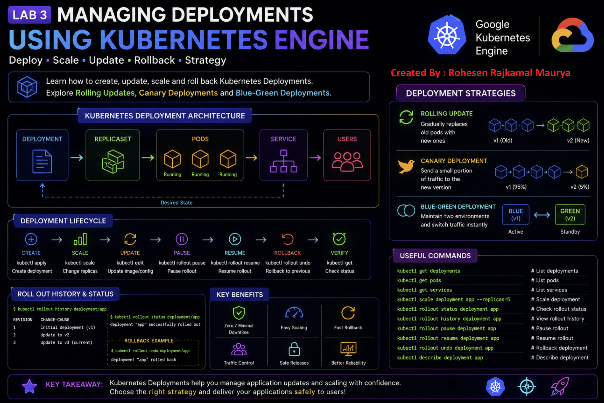
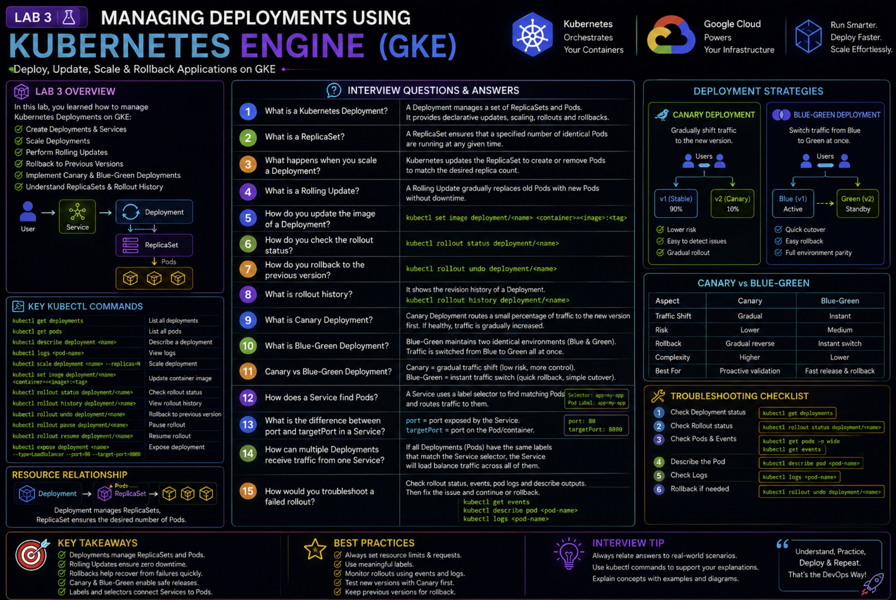

# 🚀 Managing Deployments Using Kubernetes Engine

## 🧪 Lab Overview

This lab demonstrates how to create, manage, scale, update, and roll back Kubernetes Deployments using Google Kubernetes Engine (GKE).

The lab also covers important deployment strategies used in real-world DevOps environments:

- Rolling Updates
- Canary Deployments
- Blue-Green Deployments


---

# 🎯 Objectives

In this lab, I learned how to:

- Use the `kubectl` command-line tool
- Understand Kubernetes Deployment objects
- Create Kubernetes Deployment YAML files
- Deploy applications on GKE
- Scale Kubernetes Deployments
- Perform Rolling Updates
- Pause and resume a rollout
- Roll back a deployment
- Implement Canary Deployments
- Implement Blue-Green Deployments
- Switch application traffic between different versions

---

# 🏗️ Basic Kubernetes Deployment Architecture

```text
                    Kubernetes Deployment
                             │
                             ▼
                       ReplicaSet
                             │
             ┌───────────────┼───────────────┐
             ▼               ▼               ▼
           Pod 1           Pod 2           Pod 3
             │               │               │
             └───────────────┼───────────────┘
                             │
                             ▼
                          Service
                             │
                             ▼
                         Users
````


# 🔧 Step 1: Create GKE Cluster

A GKE cluster was created with multiple nodes to run the Kubernetes workloads.

Example:

```bash
gcloud container clusters create bootcamp \
  --machine-type e2-small \
  --num-nodes 3 \
  --scopes "https://www.googleapis.com/auth/projecthosting,storage-rw"
```

Verify the cluster:

```bash
kubectl get nodes
```

### Expected Output

```text
NAME                                      STATUS   ROLES    AGE
gke-bootcamp-default-pool-xxxxx          Ready    <none>   ...
gke-bootcamp-default-pool-yyyyy          Ready    <none>   ...
gke-bootcamp-default-pool-zzzzz          Ready    <none>   ...
```

All nodes should be in the `Ready` state.

---

# 📦 Step 2: Understand Kubernetes Deployment

A Kubernetes Deployment manages a set of identical Pods.

The Deployment YAML used in this lab contained:

```yaml
apiVersion: apps/v1
kind: Deployment

metadata:
  name: fortune-app-blue

spec:
  replicas: 3

  selector:
    matchLabels:
      app: fortune-app

  template:
    metadata:
      labels:
        app: fortune-app
        track: stable
        version: "1.0.0"

    spec:
      containers:
        - name: fortune-app
          image: fortune-service:1.0.0
          ports:
            - name: http
              containerPort: 8080
```

### Important Fields

| Field           | Meaning                               |
| --------------- | ------------------------------------- |
| `apiVersion`    | Kubernetes API version                |
| `kind`          | Type of Kubernetes object             |
| `metadata.name` | Name of the Deployment                |
| `replicas`      | Number of desired Pods                |
| `selector`      | Identifies Pods managed by Deployment |
| `template`      | Pod configuration                     |
| `containers`    | Container definition                  |
| `image`         | Container image                       |
| `containerPort` | Port exposed by container             |

---

# 🚀 Step 3: Create Deployment

The Deployment was created using:

```bash
kubectl create -f deployments/fortune-app-blue.yaml
```

Verify the Deployment:

```bash
kubectl get deployments
```

### Expected Output

```text
NAME               READY   UP-TO-DATE   AVAILABLE
fortune-app-blue   3/3     3            3
```

---

# 🔗 Step 4: ReplicaSet

When a Deployment is created, Kubernetes automatically creates a ReplicaSet.

```bash
kubectl get replicasets
```

### Expected Output

```text
NAME                         DESIRED   CURRENT   READY
fortune-app-blue-xxxxxxxx    3         3         3
```

### Deployment Relationship

```text
Deployment
     │
     ▼
ReplicaSet
     │
     ├── Pod
     ├── Pod
     └── Pod
```

The Deployment manages the ReplicaSet, and the ReplicaSet manages the Pods.

---

# 🐳 Step 5: Check Pods

```bash
kubectl get pods
```

### Expected Output

```text
NAME                               READY   STATUS
fortune-app-blue-xxxxxxxx-xxxxx   1/1     Running
fortune-app-blue-xxxxxxxx-yyyyy   1/1     Running
fortune-app-blue-xxxxxxxx-zzzzz    1/1     Running
```

Three replicas of the application were running.

---

# 🌐 Step 6: Create Service

The application was exposed using a Kubernetes Service.

```bash
kubectl create -f services/fortune-app.yaml
```

Check the Service:

```bash
kubectl get services
```

The Service provides an external LoadBalancer IP.

Example:

```text
NAME          TYPE           CLUSTER-IP      EXTERNAL-IP
fortune-app   LoadBalancer   10.x.x.x        xx.xx.xx.xx
```

---

# 🔍 Step 7: Verify Application

The application version was checked using:

```bash
curl http://<EXTERNAL-IP>/version
```

### Expected Output

```json
{"version":"1.0.0"}
```

This confirmed that version `1.0.0` was running successfully.

---

# 📈 Step 8: Scale the Deployment

Kubernetes Deployments can be scaled easily.

Scale from 3 Pods to 5 Pods:

```bash
kubectl scale deployment fortune-app-blue --replicas=5
```

Verify:

```bash
kubectl get pods
```

There should now be 5 Pods.

Check the number:

```bash
kubectl get pods | grep fortune-app-blue | wc -l
```

Expected:

```text
5
```

---

# 📉 Scale Back

The Deployment was scaled back to 3 replicas:

```bash
kubectl scale deployment fortune-app-blue --replicas=3
```

Verify:

```bash
kubectl get pods | grep fortune-app-blue | wc -l
```

Expected:

```text
3
```

---

# 🔄 Step 9: Rolling Update

A Rolling Update allows us to update an application version gradually without stopping the entire application.

The image was updated from:

```text
1.0.0
```

to:

```text
2.0.0
```

The Deployment was edited using:

```bash
kubectl edit deployment fortune-app-blue
```

The image was changed to:

```yaml
image: "us-central1-docker.pkg.dev/qwiklabs-resources/spl-lab-apps/fortune-service:2.0.0"
```

The application version environment variable was also updated:

```yaml
value: "2.0.0"
```

Save the changes:

```text
Esc
:wq
Enter
```

---

# 🔍 Step 10: Check Rollout

Check ReplicaSets:

```bash
kubectl get replicasets
```

A new ReplicaSet is created for the new version.

Check rollout history:

```bash
kubectl rollout history deployment/fortune-app-blue
```

Check rollout status:

```bash
kubectl rollout status deployment/fortune-app-blue
```

Expected:

```text
deployment "fortune-app-blue" successfully rolled out
```

---

# ⏸️ Step 11: Pause Rolling Update

A rollout can be paused during an update.

```bash
kubectl rollout pause deployment/fortune-app-blue
```

Check status:

```bash
kubectl rollout status deployment/fortune-app-blue
```

During the paused rollout, different Pods can temporarily run different versions.

```text
                    Deployment
                         │
             ┌───────────┴───────────┐
             ▼                       ▼
        Old Version             New Version
          1.0.0                    2.0.0
             │                       │
          Pods                    Pods
```

---

# ▶️ Step 12: Resume Rolling Update

The rollout was resumed using:

```bash
kubectl rollout resume deployment/fortune-app-blue
```

Check status:

```bash
kubectl rollout status deployment/fortune-app-blue
```

After completion, all Pods run the new version.

---

# ↩️ Step 13: Roll Back Deployment

If the new version has a bug, Kubernetes allows us to roll back to the previous version.

```bash
kubectl rollout undo deployment/fortune-app-blue
```

Verify the application:

```bash
curl http://<EXTERNAL-IP>/version
```

### Expected Output

```json
{"version":"1.0.0"}
```

This confirms that the application was successfully rolled back.

---

# 🐤 Step 14: Canary Deployment

A Canary Deployment is used when we want to release a new version to only a small percentage of users first.

The canary Deployment was created using:

```bash
kubectl create -f deployments/fortune-app-canary.yaml
```

Check Deployments:

```bash
kubectl get deployments
```

Expected:

```text
NAME                 READY
fortune-app-blue     3/3
fortune-app-canary   1/1
```

---

# 🐤 Canary Architecture

```text
                    Service
                       │
                       ▼
              ┌────────┴────────┐
              │                 │
              ▼                 ▼
        Blue Deployment    Canary Deployment
            1.0.0              2.0.0
              │                 │
          3 Pods             1 Pod
              │                 │
              └────────┬────────┘
                       │
                     Users
```

Because both Deployments use the same application label, the Service can send traffic to both versions.

Most traffic goes to the stable version, while a smaller portion reaches the canary version.

---

# 🧪 Verify Canary Deployment

Multiple requests were sent to the application:

```bash
for i in {1..10}; do
  curl -s http://<EXTERNAL-IP>/version
  echo
done
```

Example output:

```json
{"version":"1.0.0"}
{"version":"1.0.0"}
{"version":"2.0.0"}
{"version":"1.0.0"}
{"version":"1.0.0"}
{"version":"2.0.0"}
```

This demonstrates that both versions can receive traffic.

---

# 🔵🟢 Step 15: Blue-Green Deployment

Blue-Green Deployment maintains two separate environments:

```text
BLUE  = Current Production Version
GREEN = New Version
```

Example:

```text
BLUE  → Version 1.0.0
GREEN → Version 2.0.0
```

Traffic can be switched from Blue to Green by changing the Service selector.

---

# 🔵 Blue Environment

First, the Service was configured to point to the Blue deployment:

```bash
kubectl apply -f services/fortune-app-blue-service.yaml
```

Verify:

```bash
curl http://<EXTERNAL-IP>/version
```

Expected:

```json
{"version":"1.0.0"}
```

---

# 🟢 Green Environment

The Green Deployment was created:

```bash
kubectl create -f deployments/fortune-app-green.yaml
```

The Green Deployment runs:

```text
Version 2.0.0
```

At this point:

```text
BLUE  → 1.0.0 → Production
GREEN → 2.0.0 → Ready
```

---

# 🔄 Switch Traffic to Green

The Service was updated to point to Green:

```bash
kubectl apply -f services/fortune-app-green-service.yaml
```

Verify:

```bash
curl http://<EXTERNAL-IP>/version
```

Expected:

```json
{"version":"2.0.0"}
```

Traffic is now completely served by the Green version.

---

# ↩️ Blue-Green Rollback

If version 2.0.0 has a problem, traffic can immediately be switched back to Blue.

```bash
kubectl apply -f services/fortune-app-blue-service.yaml
```

Verify:

```bash
curl http://<EXTERNAL-IP>/version
```

Expected:

```json
{"version":"1.0.0"}
```

---

# 🔵🟢 Blue-Green Architecture

```text
                     Service
                        │
                        │
              ┌─────────┴─────────┐
              │                   │
              ▼                   ▼
         BLUE DEPLOYMENT     GREEN DEPLOYMENT
             1.0.0               2.0.0
          Production             New
              │                   │
              │                   │
              └───────┬───────────┘
                      │
                Service Selector
                      │
               Switch Traffic
```

The important point is:

> **Blue-Green deployment switches traffic by changing the Service selector.**

---

# 📊 Deployment Strategies Comparison

| Strategy       | How It Works                                    | Main Benefit              |
| -------------- | ----------------------------------------------- | ------------------------- |
| Rolling Update | Gradually replaces old Pods                     | Zero/minimal downtime     |
| Canary         | Sends limited traffic to new version            | Safe testing              |
| Blue-Green     | Maintains two environments and switches traffic | Fast release and rollback |

---

# 🧠 Key Concepts Learned

## Deployment

A Deployment manages the desired state of an application.

```text
Deployment
    ↓
ReplicaSet
    ↓
Pods
```

---

## ReplicaSet

A ReplicaSet ensures that the required number of Pods are running.

For example:

```yaml
replicas: 3
```

means Kubernetes tries to maintain 3 Pods.

---

## Scaling

Scaling changes the number of application replicas.

```bash
kubectl scale deployment fortune-app-blue --replicas=5
```

---

## Rolling Update

Updates the application gradually.

```text
Old Pods
   ↓
New Pods
   ↓
Old Pods removed
   ↓
New Pods running
```

---

## Canary

Releases a new version to a small portion of users.

```text
95% → Version 1
5%  → Version 2
```

This allows the new version to be tested before completely replacing the old version.

---

## Blue-Green

Two complete versions exist simultaneously.

```text
Blue  → Production
Green → New Version
```

Traffic can be switched instantly between them.

---

# 🛠️ Useful kubectl Commands

### View Deployments

```bash
kubectl get deployments
```

### View Pods

```bash
kubectl get pods
```

### View ReplicaSets

```bash
kubectl get replicasets
```

### View Services

```bash
kubectl get services
```

### Scale Deployment

```bash
kubectl scale deployment DEPLOYMENT_NAME --replicas=5
```

### Rollout Status

```bash
kubectl rollout status deployment/DEPLOYMENT_NAME
```

### Rollout History

```bash
kubectl rollout history deployment/DEPLOYMENT_NAME
```

### Pause Rollout

```bash
kubectl rollout pause deployment/DEPLOYMENT_NAME
```

### Resume Rollout

```bash
kubectl rollout resume deployment/DEPLOYMENT_NAME
```

### Rollback

```bash
kubectl rollout undo deployment/DEPLOYMENT_NAME
```

### Describe Deployment

```bash
kubectl describe deployment DEPLOYMENT_NAME
```

---

# 🧠 Real-World DevOps Connection

These deployment strategies are commonly used in CI/CD pipelines.

For example:

```text
Developer
    │
    ▼
GitHub
    │
    ▼
CI/CD Pipeline
    │
    ▼
Docker Image
    │
    ▼
Kubernetes
    │
    ├── Rolling Update
    │
    ├── Canary
    │
    └── Blue-Green
```

This allows teams to release new application versions with less risk and better control.

---

# 📝 Important Takeaways

* A Deployment manages application Pods.
* A ReplicaSet maintains the desired number of Pods.
* Services provide stable networking and traffic routing.
* `kubectl scale` changes the number of replicas.
* Rolling Updates gradually replace old versions.
* Rollouts can be paused and resumed.
* `kubectl rollout undo` provides rollback capability.
* Canary deployments expose a new version to a smaller portion of traffic.
* Blue-Green deployments keep two versions and switch traffic using Service selectors.

---

# 🏁 Lab Outcome

* ✅ Created a Kubernetes Deployment
* ✅ Created a ReplicaSet
* ✅ Deployed multiple application Pods
* ✅ Exposed the application using a Service
* ✅ Scaled the Deployment
* ✅ Performed a Rolling Update
* ✅ Paused and resumed a rollout
* ✅ Rolled back a deployment
* ✅ Created a Canary Deployment
* ✅ Implemented a Blue-Green Deployment
* ✅ Switched traffic between application versions

---

# 🎓 Final Learning

The biggest lesson from this lab was understanding **how Kubernetes manages application versions in production**.

```text
                   Kubernetes Deployment
                            │
          ┌─────────────────┼─────────────────┐
          │                 │                 │
          ▼                 ▼                 ▼
      Rolling            Canary          Blue-Green
       Update             Release           Release
          │                 │                 │
     Gradual Update    Limited Users     Traffic Switch
          │                 │                 │
          └─────────────────┼─────────────────┘
                            ▼
                    Safer Deployments
```

> **Kubernetes Deployments make application updates, scaling, rollback, and release strategies easier and more reliable.**

---

## 🏆 Lab Status

**Status:** ✅ Completed

**Lab:** Managing Deployments Using Kubernetes Engine

**Lab ID:** GSP053

**Platform:** Google Cloud Skills Boost

**Technologies:** Kubernetes, GKE, kubectl, Docker, DevOps

## Interview Questions
 
