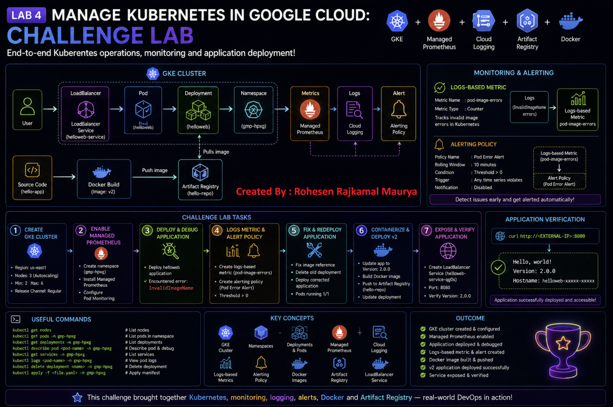

# 🚀 Manage Kubernetes in Google Cloud — Challenge Lab

## 🧪 Lab Overview

This challenge lab demonstrates practical Kubernetes and Google Kubernetes Engine (GKE) skills learned throughout the Google Cloud Kubernetes labs.

Unlike a guided lab, this challenge lab requires solving tasks independently using Kubernetes, GKE, Artifact Registry, Docker, Cloud Logging, and Managed Prometheus.


---

# 🎯 Lab Objectives

In this challenge lab, I demonstrated how to:

- Create and configure a GKE cluster
- Enable Managed Service for Prometheus
- Create Kubernetes namespaces
- Deploy Kubernetes applications
- Debug Kubernetes deployment errors
- Create logs-based metrics
- Create alerting policies
- Update Kubernetes manifests
- Containerize an application using Docker
- Push Docker images to Artifact Registry
- Update Kubernetes Deployments
- Expose applications using LoadBalancer Services
- Verify application versions

---

# 🏗️ Technologies Used

| Technology | Purpose |
|---|---|
| Google Kubernetes Engine (GKE) | Kubernetes cluster |
| Kubernetes | Container orchestration |
| kubectl | Kubernetes CLI |
| Managed Prometheus | Application metrics |
| Cloud Logging | Log monitoring |
| Cloud Monitoring | Metrics and alerts |
| Artifact Registry | Docker image storage |
| Docker | Containerization |
| Cloud Shell | Command-line environment |

---

# 📋 Challenge Tasks

The challenge consisted of six major tasks:

```text
Task 1 → Create GKE Cluster
Task 2 → Enable Managed Prometheus
Task 3 → Deploy Application & Debug Error
Task 4 → Create Logs Metric & Alert
Task 5 → Fix & Redeploy Application
Task 6 → Containerize & Deploy Version 2
````

---

# ☁️ Task 1: Create GKE Cluster

A GKE cluster was created with the required configuration.

### Configuration

```text
Cluster Name    : hello-world-ptyy
Region          : us-east1
Zone            : us-east1-b
Release Channel : Regular
Nodes           : 3
Autoscaling     : Enabled
Minimum Nodes   : 2
Maximum Nodes   : 6
```

### Cluster Architecture

```text
                    GKE Cluster
                        │
            ┌───────────┼───────────┐
            │           │           │
          Node 1      Node 2      Node 3
            │           │           │
           Pods        Pods        Pods
```

### Verification

```bash
gcloud container clusters list
```

```bash
kubectl get nodes
```

### Expected Result

All cluster nodes should be in:

```text
Ready
```

state.

---

# 📊 Task 2: Enable Managed Prometheus

Managed Prometheus was enabled for collecting metrics from applications running inside the GKE cluster.

A dedicated namespace was created:

```text
gmp-hpxg
```

### Namespace

```bash
kubectl create namespace gmp-hpxg
```

Verify:

```bash
kubectl get namespaces
```

---

# 📈 Prometheus Application

The sample Prometheus application was downloaded:

```bash
gcloud storage cp gs://spls/gsp510/prometheus-app.yaml .
```

The required configuration was added:

```yaml
image: nilebox/prometheus-example-app:latest
name: prometheus-test
ports:
  - name: metrics
```

The application was deployed into the namespace:

```bash
kubectl apply -f prometheus-app.yaml -n gmp-hpxg
```

---

# 🔍 Pod Monitoring

The PodMonitoring configuration was downloaded:

```bash
gcloud storage cp gs://spls/gsp510/pod-monitoring.yaml .
```

The required configuration was:

```yaml
metadata:
  name: prometheus-test

labels:
  app.kubernetes.io/name: prometheus-test

matchLabels:
  app: prometheus-test

interval: 45s
```

The PodMonitoring resource was applied:

```bash
kubectl apply -f pod-monitoring.yaml -n gmp-hpxg
```

### Verify

```bash
kubectl get pods -n gmp-hpxg
```

```bash
kubectl get podmonitoring -n gmp-hpxg
```

### Result

Prometheus monitoring was successfully configured for the sample application.

---

# 🚀 Task 3: Deploy Application

The application files were downloaded:

```bash
gcloud storage cp -r gs://spls/gsp510/hello-app/ .
```

The deployment manifest was located at:

```text
hello-app/manifests/helloweb-deployment.yaml
```

The application was deployed into:

```text
gmp-hpxg
```

namespace.

Example:

```bash
kubectl apply \
  -f hello-app/manifests/helloweb-deployment.yaml \
  -n gmp-hpxg
```

---

# 🐛 Debugging the Deployment

After deployment, the application showed an error:

```text
InvalidImageName
```

The problem was caused by an invalid image reference in the Kubernetes manifest.

Example error:

```text
Error: InvalidImageName

Failed to apply default image tag "<todo>":
couldn't parse image reference "<todo>":
invalid reference format
```

### Debugging Commands

```bash
kubectl get pods -n gmp-hpxg
```

```bash
kubectl describe pod <POD_NAME> -n gmp-hpxg
```

```bash
kubectl get deployment -n gmp-hpxg
```

The error was identified from the Pod events.

---

# 📜 Task 4: Logs-Based Metric

A logs-based metric was created to track Kubernetes image errors.

### Metric Name

```text
pod-image-errors
```

### Metric Type

```text
Counter
```

The metric tracks errors related to invalid container images.

---

# 🚨 Alerting Policy

An alerting policy was created using the logs-based metric.

### Configuration

```text
Policy Name        : Pod Error Alert
Rolling Window     : 10 minutes
Window Function    : Count
Aggregation        : Sum
Condition          : Threshold
Trigger             : Any time series violates
Threshold          : Above 0
Notification       : Disabled
```

### Concept

```text
Kubernetes Error
       │
       ▼
Cloud Logging
       │
       ▼
Logs-Based Metric
       │
       ▼
pod-image-errors
       │
       ▼
Alert Policy
       │
       ▼
Pod Error Alert
```

This allows the team to detect recurring Kubernetes application errors automatically.

---

# 🔧 Task 5: Fix and Redeploy Application

The invalid image reference in the Deployment manifest was replaced with the correct image:

```text
us-docker.pkg.dev/google-samples/containers/gke/hello-app:1.0
```

The existing Deployment was deleted:

```bash
kubectl delete deployment helloweb -n gmp-hpxg
```

The corrected Deployment was deployed:

```bash
kubectl apply \
  -f hello-app/manifests/helloweb-deployment.yaml \
  -n gmp-hpxg
```

---

# ✅ Verify Deployment

```bash
kubectl get deployments -n gmp-hpxg
```

```bash
kubectl get pods -n gmp-hpxg
```

Expected state:

```text
READY   1/1
STATUS  Running
```

The previous `InvalidImageName` error was resolved.

---

# 🐳 Task 6: Containerize Application

The application source code was provided inside:

```text
hello-app/
```

The application version was updated in:

```text
main.go
```

The version was changed to:

```text
Version: 2.0.0
```

---

# 🏗️ Build Docker Image

The existing Dockerfile was used to containerize the application.

The image was built with the `v2` tag.

Example:

```bash
docker build -t <IMAGE_PATH>:v2 .
```

The image was then pushed to Artifact Registry.

---

# 📦 Artifact Registry

The provided repository was:

```text
hello-repo
```

The Docker image was pushed using the `v2` tag.

Conceptually:

```text
Source Code
    │
    ▼
Dockerfile
    │
    ▼
Docker Image
    │
    ▼
Artifact Registry
    │
    ▼
hello-repo
    │
    ▼
v2
```

---

# 🚀 Update Kubernetes Deployment

The `helloweb` Deployment was updated to use the newly built `v2` image.

The Deployment now runs the updated application:

```text
Version: 2.0.0
```

---

# 🌐 Expose Application

The application was exposed using a LoadBalancer Service.

### Service Name

```text
helloweb-service-qg0s
```

### Port

```text
8080
```

The Service exposes the application externally.

Architecture:

```text
                 Internet
                    │
                    ▼
             LoadBalancer
                    │
                    ▼
        helloweb-service-qg0s
                    │
                    ▼
             Kubernetes Pod
                    │
                    ▼
             hello-app:v2
```

---

# 🔍 Final Application Verification

After deploying the new image and exposing the Service, the external LoadBalancer IP was used to verify the application.

Expected response:

```text
Hello, world!
Version: 2.0.0
Hostname: helloweb-xxxxxxxxxx-xxxxx
```

The hostname is generated dynamically by Kubernetes, so it can be different for every deployment.

---

# 🧠 Important Concepts Learned

## 1. GKE Cluster

GKE provides managed Kubernetes clusters on Google Cloud.

```text
Google Cloud
     │
     ▼
    GKE
     │
     ▼
 Kubernetes Cluster
     │
     ▼
    Nodes
     │
     ▼
    Pods
```

---

## 2. Managed Prometheus

Managed Prometheus collects application and Kubernetes metrics without requiring us to manage the entire Prometheus infrastructure ourselves.

```text
Application
     │
     ▼
Metrics
     │
     ▼
Prometheus
     │
     ▼
Cloud Monitoring
```

---

## 3. Kubernetes Namespace

Namespaces logically separate Kubernetes resources.

Example:

```text
Cluster
   │
   ├── default
   │
   ├── kube-system
   │
   └── gmp-hpxg
          │
          ├── Deployments
          ├── Pods
          └── Services
```

---

## 4. Logs-Based Metric

A logs-based metric converts matching log entries into measurable data.

```text
Logs
 │
 ▼
Filter
 │
 ▼
Logs-Based Metric
 │
 ▼
Monitoring
 │
 ▼
Alert
```

---

## 5. Artifact Registry

Artifact Registry stores container images used by Kubernetes workloads.

```text
Developer
    │
    ▼
Docker Build
    │
    ▼
Docker Image
    │
    ▼
Artifact Registry
    │
    ▼
GKE
```

---

# 🐳 Docker + Kubernetes Workflow

The complete application deployment workflow learned in this lab:

```text
Developer Code
      │
      ▼
   Dockerfile
      │
      ▼
 Docker Build
      │
      ▼
 Docker Image
      │
      ▼
Artifact Registry
      │
      ▼
 Kubernetes Deployment
      │
      ▼
     Pod
      │
      ▼
   Service
      │
      ▼
    Users
```

---

# 🛠️ Useful Commands

### Check GKE clusters

```bash
gcloud container clusters list
```

### Check Kubernetes nodes

```bash
kubectl get nodes
```

### Check namespaces

```bash
kubectl get namespaces
```

### Check Pods

```bash
kubectl get pods -n gmp-hpxg
```

### Check Deployments

```bash
kubectl get deployments -n gmp-hpxg
```

### Describe Pod

```bash
kubectl describe pod <POD_NAME> -n gmp-hpxg
```

### Check Services

```bash
kubectl get services -n gmp-hpxg
```

### Apply a manifest

```bash
kubectl apply -f <FILE>.yaml -n gmp-hpxg
```

### Delete a Deployment

```bash
kubectl delete deployment <DEPLOYMENT_NAME> -n gmp-hpxg
```

---

# 📊 Challenge Summary

| Task | Activity                   | Result      |
| ---- | -------------------------- | ----------- |
| 1    | Create GKE Cluster         | ✅ Completed |
| 2    | Enable Managed Prometheus  | ✅ Completed |
| 3    | Deploy & Debug Application | ✅ Completed |
| 4    | Logs Metric & Alert        | ✅ Completed |
| 5    | Fix & Redeploy             | ✅ Completed |
| 6    | Containerize & Deploy v2   | ✅ Completed |

---

# 🏆 Final Outcome

Successfully completed the GSP510 challenge lab and demonstrated practical skills in:

* ✅ GKE cluster management
* ✅ Kubernetes deployments
* ✅ Kubernetes namespaces
* ✅ Managed Prometheus
* ✅ PodMonitoring
* ✅ Kubernetes troubleshooting
* ✅ Cloud Logging
* ✅ Logs-based metrics
* ✅ Cloud Monitoring alerts
* ✅ Docker containerization
* ✅ Artifact Registry
* ✅ Kubernetes Services
* ✅ LoadBalancer
* ✅ Application version upgrades

---

# 🎓 Key Takeaway

This challenge lab connected multiple DevOps concepts into one real-world workflow:

```text
                 ┌─────────────────┐
                 │   Source Code   │
                 └────────┬────────┘
                          │
                          ▼
                 ┌─────────────────┐
                 │     Docker      │
                 └────────┬────────┘
                          │
                          ▼
                 ┌─────────────────┐
                 │Artifact Registry│
                 └────────┬────────┘
                          │
                          ▼
                 ┌─────────────────┐
                 │       GKE       │
                 └────────┬────────┘
                          │
              ┌───────────┼───────────┐
              ▼           ▼           ▼
           Deploy      Monitor      Logs
              │           │           │
              ▼           ▼           ▼
           Service   Prometheus     Alert
              │
              ▼
            Users
```

> **The main lesson: Modern DevOps is not just about deploying an application. It is about deploying, monitoring, debugging, updating, and reliably operating that application in production.**

---

# 🏁 Lab Status

**Status:** ✅ Completed

**Lab:** Manage Kubernetes in Google Cloud — Challenge Lab

**Lab ID:** GSP510

**Platform:** Google Cloud Skills Boost

**Focus:** GKE + Kubernetes + Prometheus + Monitoring + Docker + Artifact Registry
