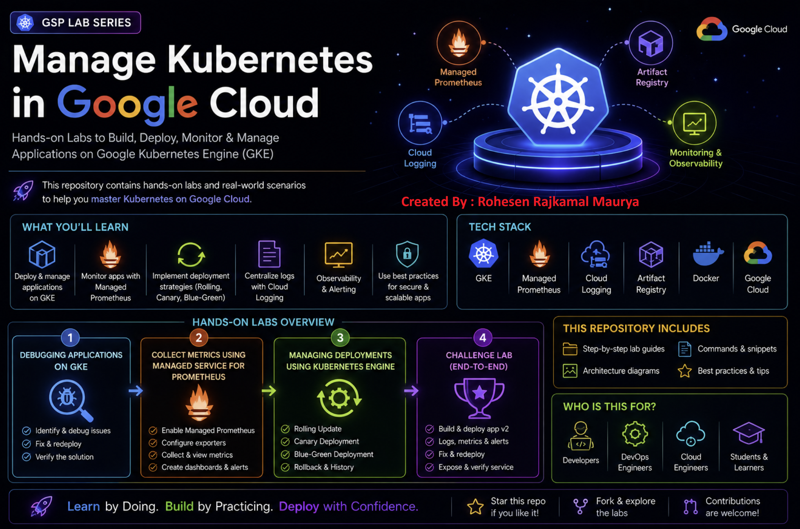

# ☸️ Kubernetes & Google Kubernetes Engine — Hands-on Labs




> My hands-on journey of learning Kubernetes, Google Kubernetes Engine (GKE), deployments, rollout strategies, monitoring, troubleshooting, Docker and Artifact Registry.

---

# 📚 About This Repository

This repository contains my practical work from Google Cloud Kubernetes labs.

The focus is on understanding how Kubernetes applications are:

- Deployed
- Scaled
- Updated
- Monitored
- Debugged
- Rolled back
- Exposed to users
- Containerized
- Released using different deployment strategies

The labs helped me move from basic Kubernetes concepts toward practical GKE and DevOps workflows.

---

# 🗺️ Learning Journey

```text
Containers
    ↓
Kubernetes
    ↓
Pods
    ↓
Deployments
    ↓
ReplicaSets
    ↓
Services
    ↓
Scaling
    ↓
Rolling Updates
    ↓
Rollback
    ↓
Canary Deployment
    ↓
Blue-Green Deployment
    ↓
GKE
    ↓
Managed Prometheus
    ↓
Monitoring
    ↓
Logging & Alerting
    ↓
Artifact Registry
    ↓
Docker + GKE Deployment
````


# 🧪 Labs Completed

| # | Lab                                          | GSP     | Status      |
| - | -------------------------------------------- | ------- | ----------- |
| 1 | Kubernetes Fundamentals / Practice           | GSP736  | ✅ Completed |
| 2 | Kubernetes / GKE Hands-on Practice           | GSP1026 | ✅ Completed |
| 3 | Managing Deployments Using Kubernetes Engine | GSP053  | ✅ Completed |
| 4 | GKE Challenge Lab                            | GSP510  | ✅ Completed |

---

# 🚀 LAB 3 — Managing Deployments Using Kubernetes Engine

## GSP053

### 🎯 Objectives

In this lab I practiced:

* Using `kubectl`
* Understanding Deployment objects
* Creating Deployment YAML files
* Launching applications
* Scaling Deployments
* Performing rolling updates
* Pausing and resuming rollouts
* Rolling back deployments
* Canary deployments
* Blue-Green deployments
* Working with Kubernetes Services

---

# 1️⃣ Kubernetes Deployment Object

First, I explored the Deployment object using:

```bash
kubectl explain deployment
```

For detailed information:

```bash
kubectl explain deployment --recursive
```

Specific field:

```bash
kubectl explain deployment.metadata.name
```

### Concept

```text
Deployment
     ↓
ReplicaSet
     ↓
Pods
```

A Deployment manages ReplicaSets, and ReplicaSets maintain the desired number of Pods.

---

# 2️⃣ Create Fortune Application

The lab used:

```text
Deployment:
fortune-app-blue

Replicas:
3

Version:
1.0.0
```

Deployment was created using:

```bash
kubectl create -f deployments/fortune-app-blue.yaml
```

Check Deployment:

```bash
kubectl get deployments
```

### Expected Output

```text
NAME               READY   UP-TO-DATE   AVAILABLE
fortune-app-blue   3/3     3            3
```

---

# 3️⃣ ReplicaSet

Check ReplicaSets:

```bash
kubectl get replicasets
```

### Expected Output

```text
NAME                         DESIRED   CURRENT   READY
fortune-app-blue-xxxxxxxx   3         3         3
```

The exact suffix is generated by Kubernetes and will be different for each deployment.

---

# 4️⃣ Pods

Check Pods:

```bash
kubectl get pods
```

### Expected Output

```text
NAME                              READY   STATUS    RESTARTS
fortune-app-blue-xxxxxxxx-abc    1/1     Running   0
fortune-app-blue-xxxxxxxx-def    1/1     Running   0
fortune-app-blue-xxxxxxxx-ghi    1/1     Running   0
```

---

# 5️⃣ Expose Application

Create the Service:

```bash
kubectl create -f services/fortune-app.yaml
```

Check Service:

```bash
kubectl get services fortune-app
```

After the external IP becomes available:

```bash
curl http://<EXTERNAL-IP>/version
```

### Output

```json
{"version":"1.0.0"}
```

This confirmed that version `1.0.0` was running.

---

# 6️⃣ Scale Deployment

Initially:

```text
3 Pods
```

Scale to 5:

```bash
kubectl scale deployment fortune-app-blue --replicas=5
```

Verify:

```bash
kubectl get pods | grep fortune-app-blue | wc -l
```

### Output

```text
5
```

Scale back:

```bash
kubectl scale deployment fortune-app-blue --replicas=3
```

Verify:

```bash
kubectl get pods | grep fortune-app-blue | wc -l
```

### Output

```text
3
```

### Concept

```text
3 Pods
  ↓
Scale Up
  ↓
5 Pods
  ↓
Scale Down
  ↓
3 Pods
```

---

# 7️⃣ Rolling Update

The application was updated from:

```text
Version 1.0.0
        ↓
Version 2.0.0
```

Edit the Deployment:

```bash
kubectl edit deployment fortune-app-blue
```

Change the image from:

```text
fortune-service:1.0.0
```

to:

```text
fortune-service:2.0.0
```

Also update:

```text
APP_VERSION
```

from:

```text
1.0.0
```

to:

```text
2.0.0
```

Save:

```text
Esc
:wq
Enter
```

---

# 8️⃣ ReplicaSet During Rolling Update

Check:

```bash
kubectl get replicasets
```

Kubernetes creates a new ReplicaSet for the new version.

Conceptually:

```text
Old ReplicaSet
Version 1.0.0
      ↓
New ReplicaSet
Version 2.0.0
```

Pods are gradually replaced.

---

# 9️⃣ Rollout History

Check rollout history:

```bash
kubectl rollout history deployment/fortune-app-blue
```

### Expected

```text
deployment.apps/fortune-app-blue
REVISION  CHANGE-CAUSE
1         <none>
2         <none>
```

---

# 🔟 Pause Rolling Update

Pause:

```bash
kubectl rollout pause deployment/fortune-app-blue
```

Check:

```bash
kubectl rollout status deployment/fortune-app-blue
```

During the paused rollout, both versions can exist.

```text
Version 1.0.0
     +
Version 2.0.0
     ↓
Mixed Pods
```

This allows us to inspect the application before completing the rollout.

---

# 1️⃣1️⃣ Resume Rolling Update

Resume:

```bash
kubectl rollout resume deployment/fortune-app-blue
```

Check:

```bash
kubectl rollout status deployment/fortune-app-blue
```

### Expected

```text
deployment "fortune-app-blue" successfully rolled out
```

---

# 1️⃣2️⃣ Rollback

If version `2.0.0` has a bug:

```bash
kubectl rollout undo deployment/fortune-app-blue
```

Verify:

```bash
kubectl rollout status deployment/fortune-app-blue
```

Check application:

```bash
curl http://`kubectl get svc fortune-app -o=jsonpath="{.status.loadBalancer.ingress[0].ip}"`/version
```

### Expected

```json
{"version":"1.0.0"}
```

### Key Concept

```text
Version 1.0.0
      ↓
Version 2.0.0
      ↓
Problem
      ↓
Rollback
      ↓
Version 1.0.0
```

---

# 🐤 13️⃣ Canary Deployment

Canary deployment allows us to test a new version with only a small portion of traffic.

Create:

```bash
kubectl create -f deployments/fortune-app-canary.yaml
```

Check:

```bash
kubectl get deployments
```

Now two Deployments exist:

```text
fortune-app-blue
fortune-app-canary
```

The Service selects:

```text
app: fortune-app
```

Therefore, Pods from both deployments can receive traffic.

---

# Test Canary

```bash
for i in {1..10}; do curl -s http://`kubectl get svc fortune-app -o=jsonpath="{.status.loadBalancer.ingress[0].ip}"`/version; echo; done
```

### Representative Output

```text
{"version":"1.0.0"}
{"version":"1.0.0"}
{"version":"1.0.0"}
{"version":"2.0.0"}
{"version":"1.0.0"}
{"version":"1.0.0"}
{"version":"2.0.0"}
{"version":"1.0.0"}
{"version":"1.0.0"}
{"version":"1.0.0"}
```

Most traffic goes to `1.0.0`, while a smaller portion reaches `2.0.0`.

### Canary Concept

```text
                 Service
                    │
          ┌─────────┴─────────┐
          ↓                   ↓
       BLUE                 CANARY
      v1.0.0                v2.0.0
       90%                    10%
```

---

# 🔵🟢 14️⃣ Blue-Green Deployment

Blue-Green deployment maintains two complete versions:

```text
🔵 BLUE  → v1.0.0

🟢 GREEN → v2.0.0
```

First point the Service to Blue:

```bash
kubectl apply -f services/fortune-app-blue-service.yaml
```

Create Green:

```bash
kubectl create -f deployments/fortune-app-green.yaml
```

Verify current version:

```bash
curl http://`kubectl get svc fortune-app -o=jsonpath="{.status.loadBalancer.ingress[0].ip}"`/version
```

### Output

```json
{"version":"1.0.0"}
```

Switch traffic to Green:

```bash
kubectl apply -f services/fortune-app-green-service.yaml
```

Verify:

```bash
curl http://`kubectl get svc fortune-app -o=jsonpath="{.status.loadBalancer.ingress[0].ip}"`/version
```

### Output

```json
{"version":"2.0.0"}
```

Rollback:

```bash
kubectl apply -f services/fortune-app-blue-service.yaml
```

Verify:

```json
{"version":"1.0.0"}
```

---

# 🧠 Deployment Strategies Comparison

| Strategy       | How it works                              | Main Benefit              |
| -------------- | ----------------------------------------- | ------------------------- |
| Rolling Update | Gradually replaces old Pods               | No full downtime          |
| Canary         | Small traffic goes to new version         | Safe testing              |
| Blue-Green     | Switches traffic between two environments | Instant version switch    |
| Rollback       | Returns to previous version               | Recovery from bad release |

---

# ☁️ LAB 4 — GKE Challenge Lab

## GSP510

This challenge lab tested practical GKE administration and troubleshooting.

---

# 1️⃣ Create GKE Cluster

Cluster configuration:

```text
Cluster Name:
hello-world-ptyy

Zone:
us-east1-b

Release Channel:
Regular

Nodes:
3

Minimum Nodes:
2

Maximum Nodes:
6

Autoscaling:
Enabled
```

### Concept

```text
GKE Cluster
     │
     ├── Node 1
     ├── Node 2
     └── Node 3

Autoscaler
     │
     ├── Minimum: 2
     └── Maximum: 6
```

---

# 2️⃣ Enable Managed Prometheus

Created namespace:

```bash
kubectl create namespace gmp-hpxg
```

Downloaded:

```bash
gcloud storage cp gs://spls/gsp510/prometheus-app.yaml .
```

Configured:

```text
Image:
nilebox/prometheus-example-app:latest

Container:
prometheus-test

Port:
metrics
```

Deploy:

```bash
kubectl apply -f prometheus-app.yaml -n gmp-hpxg
```

---

# 3️⃣ Pod Monitoring

Downloaded:

```bash
gcloud storage cp gs://spls/gsp510/pod-monitoring.yaml .
```

Configured:

```text
Name:
prometheus-test

Label:
app.kubernetes.io/name: prometheus-test

Match:
app: prometheus-test

Interval:
45s
```

Applied:

```bash
kubectl apply -f pod-monitoring.yaml -n gmp-hpxg
```

### Monitoring Architecture

```text
Prometheus
     │
     ▼
PodMonitoring
     │
     ▼
prometheus-test
     │
 ┌───┼───┐
 ▼   ▼   ▼
Pod Pod Pod
```

---

# 4️⃣ Deploy Application

Downloaded:

```bash
gcloud storage cp -r gs://spls/gsp510/hello-app/ .
```

Deployment manifest:

```text
hello-app/manifests/helloweb-deployment.yaml
```

The initial deployment intentionally contained an invalid image.

### Error

```text
InvalidImageName
```

More specifically:

```text
Failed to apply default image tag "<todo>":
couldn't parse image reference "<todo>":
invalid reference format
```

This demonstrated Kubernetes troubleshooting.

---

# 5️⃣ Logs-Based Metric

Created logs-based metric:

```text
pod-image-errors
```

Metric type:

```text
Counter
```

The metric tracks image-related errors.

---

# 6️⃣ Alerting Policy

Created:

```text
Pod Error Alert
```

Configuration:

```text
Rolling Window:
10 min

Function:
Count

Aggregation:
Sum

Condition:
Threshold

Trigger:
Any time series violates

Threshold:
Above 0

Notification:
Disabled
```

### Concept

```text
Kubernetes Error
       ↓
Cloud Logging
       ↓
Logs-Based Metric
       ↓
Alerting Policy
       ↓
Detect Problem
```

---

# 7️⃣ Fix Deployment

The incorrect image was replaced with:

```text
us-docker.pkg.dev/google-samples/containers/gke/hello-app:1.0
```

Delete old deployment:

```bash
kubectl delete deployment helloweb -n gmp-hpxg
```

Deploy corrected manifest:

```bash
kubectl apply -f hello-app/manifests/helloweb-deployment.yaml -n gmp-hpxg
```

Verify:

```bash
kubectl get deployments -n gmp-hpxg
```

Check Pods:

```bash
kubectl get pods -n gmp-hpxg
```

### Expected

```text
helloweb   1/1   Running
```

---

# 🐳 8️⃣ Containerize Application

Updated:

```text
hello-app/main.go
```

Application version:

```text
2.0.0
```

Created Docker image:

```text
v2
```

The image was pushed to Artifact Registry.

Concept:

```text
Source Code
     ↓
Dockerfile
     ↓
Docker Image
     ↓
Artifact Registry
     ↓
GKE Deployment
```

---

# 9️⃣ Deploy v2

The Deployment was updated to use the newly built `v2` image.

Artifact Registry repository:

```text
hello-repo
```

---

# 🌐 10️⃣ Expose Application

Created LoadBalancer Service:

```text
helloweb-service-qg0s
```

Application exposed on:

```text
Port:
8080
```

The target port was configured according to the Dockerfile.

---

# 🎯 Final Application Output

Expected response:

```text
Hello, world!
Version: 2.0.0
Hostname: helloweb-xxxxxxxxxxxxxxxx
```

The hostname is generated dynamically by Kubernetes, so the exact value will differ.

---

# 🧰 Important kubectl Commands

## Check cluster

```bash
kubectl cluster-info
```

## Nodes

```bash
kubectl get nodes
```

## Pods

```bash
kubectl get pods
```

## Pods in namespace

```bash
kubectl get pods -n gmp-hpxg
```

## Deployments

```bash
kubectl get deployments
```

## Services

```bash
kubectl get services
```

## ReplicaSets

```bash
kubectl get replicasets
```

## Namespaces

```bash
kubectl get namespaces
```

## Describe resource

```bash
kubectl describe pod <pod-name>
```

## Logs

```bash
kubectl logs <pod-name>
```

## Events

```bash
kubectl get events
```

## Apply YAML

```bash
kubectl apply -f file.yaml
```

## Create from YAML

```bash
kubectl create -f file.yaml
```

## Delete deployment

```bash
kubectl delete deployment <deployment-name>
```

---

# 🔄 Rollout Commands

```bash
kubectl rollout status deployment/<deployment-name>
```

```bash
kubectl rollout history deployment/<deployment-name>
```

```bash
kubectl rollout pause deployment/<deployment-name>
```

```bash
kubectl rollout resume deployment/<deployment-name>
```

```bash
kubectl rollout undo deployment/<deployment-name>
```

---

# 🧠 Kubernetes Mental Model

The most important hierarchy to remember:

```text
                 Deployment
                      │
                      ▼
                 ReplicaSet
                      │
                      ▼
                     Pods
                      │
                      ▼
                 Containers
```

Networking:

```text
                    User
                      │
                      ▼
                  Service
                      │
          ┌───────────┼───────────┐
          ▼           ▼           ▼
         Pod         Pod         Pod
```

---

# 🔥 Deployment Strategies — Easy Memory

```text
ROLLING
───────
Old → gradually → New


CANARY
──────
Most Users → Old
Few Users  → New


BLUE-GREEN
──────────
Blue = Old
Green = New

Switch:
Blue → Green
```

---

# 🧩 Troubleshooting Flow

When a Kubernetes application is not working:

```text
kubectl get pods
        ↓
Is Pod Running?
        ↓
     NO
        ↓
kubectl describe pod
        ↓
Check Events
        ↓
kubectl logs
        ↓
Find Error
        ↓
Fix Manifest / Image / Configuration
        ↓
kubectl apply
        ↓
Verify Again
```

---

# 📊 What I Learned

Through these hands-on labs, I practiced:

* Kubernetes Deployments
* Pods
* ReplicaSets
* Services
* Scaling
* Rolling Updates
* Rollouts
* Rollbacks
* Canary Deployments
* Blue-Green Deployments
* GKE cluster creation
* GKE autoscaling
* Managed Prometheus
* PodMonitoring
* Cloud Logging
* Logs-based metrics
* Alerting policies
* Kubernetes troubleshooting
* Docker image creation
* Artifact Registry
* LoadBalancer Services
* Application deployment on GKE

---

# 🏆 Key Takeaways

### 1. Deployment manages application versions

```text
Deployment
     ↓
ReplicaSet
     ↓
Pods
```

### 2. Service provides stable access

```text
Client
  ↓
Service
  ↓
Pods
```

### 3. Scaling changes the number of Pods

```text
3 Pods → 5 Pods
```

### 4. Rolling Update gradually replaces versions

```text
v1 → v1/v2 → v2
```

### 5. Canary reduces deployment risk

```text
90% → Old
10% → New
```

### 6. Blue-Green provides instant traffic switching

```text
Blue → Green
```

### 7. Rollback helps recover from bad releases

```text
v2 → Problem → v1
```

### 8. Monitoring helps detect problems

```text
Application
    ↓
Metrics / Logs
    ↓
Monitoring
    ↓
Alert
```

---

# 🛠️ Technology Stack

```text
Kubernetes
Google Kubernetes Engine (GKE)
kubectl
Docker
Artifact Registry
Managed Prometheus
PodMonitoring
Cloud Logging
Cloud Monitoring
YAML
Google Cloud
```

---

# 🚀 Next Learning Goals

After completing these labs, the next Kubernetes topics to learn are:

```text
ConfigMaps
    ↓
Secrets
    ↓
Persistent Volumes
    ↓
Persistent Volume Claims
    ↓
Ingress
    ↓
RBAC
    ↓
Service Accounts
    ↓
Horizontal Pod Autoscaler
    ↓
Helm
    ↓
Kubernetes Networking
    ↓
Prometheus + Grafana
    ↓
CI/CD + Kubernetes
    ↓
Terraform + GKE
```

---

# ⭐ Final Takeaway

These labs helped me understand that Kubernetes is not simply a platform for running containers.

It provides a complete system for managing the application lifecycle:

```text
             ┌─────────────┐
             │   Deploy    │
             └──────┬──────┘
                    ↓
             ┌─────────────┐
             │    Scale    │
             └──────┬──────┘
                    ↓
             ┌─────────────┐
             │   Monitor   │
             └──────┬──────┘
                    ↓
             ┌─────────────┐
             │   Update    │
             └──────┬──────┘
                    ↓
             ┌─────────────┐
             │   Detect    │
             │   Problems  │
             └──────┬──────┘
                    ↓
             ┌─────────────┐
             │ Fix/Rollback│
             └──────┬──────┘
                    ↓
             ┌─────────────┐
             │ Safe Release│
             └─────────────┘
```

---

# 📌 Repository Status

```text
Kubernetes Learning
        │
        ├── GSP053 ✅
        │
        ├── GSP510 ✅
        │
        ├── Deployments ✅
        │
        ├── Scaling ✅
        │
        ├── Rolling Updates ✅
        │
        ├── Rollback ✅
        │
        ├── Canary ✅
        │
        ├── Blue-Green ✅
        │
        ├── GKE ✅
        │
        ├── Managed Prometheus ✅
        │
        ├── Monitoring ✅
        │
        ├── Logging & Alerting ✅
        │
        └── Docker + Artifact Registry ✅
```

---

## 👨‍💻 Learning by Doing

> The goal of this repository is not just to memorize Kubernetes commands, but to understand how Kubernetes is used to deploy, scale, monitor, troubleshoot and safely release applications in real-world environments.
